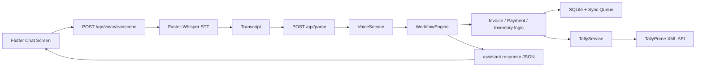

# AI Tally Architecture

This repo is an MVP offline-first assistant for TallyPrime users.

Pipeline:

1. The Flutter chat screen records WAV audio locally and uploads it to `/api/voice/transcribe`.
2. The backend converts the audio through Faster-Whisper and returns text.
3. The same chat session sends the transcript to `/api/parse`.
4. `/api/parse` routes through `VoiceService` into `WorkflowEngine` for rule-based intent handling.
5. Workflow actions either write locally to SQLite or enqueue sync work for TallyPrime when offline.
6. `ConnectorService` sends invoice actions to TallyPrime and queues payment or inventory actions until they are implemented or retried.

This is intentionally an MVP architecture, not a production-complete system.